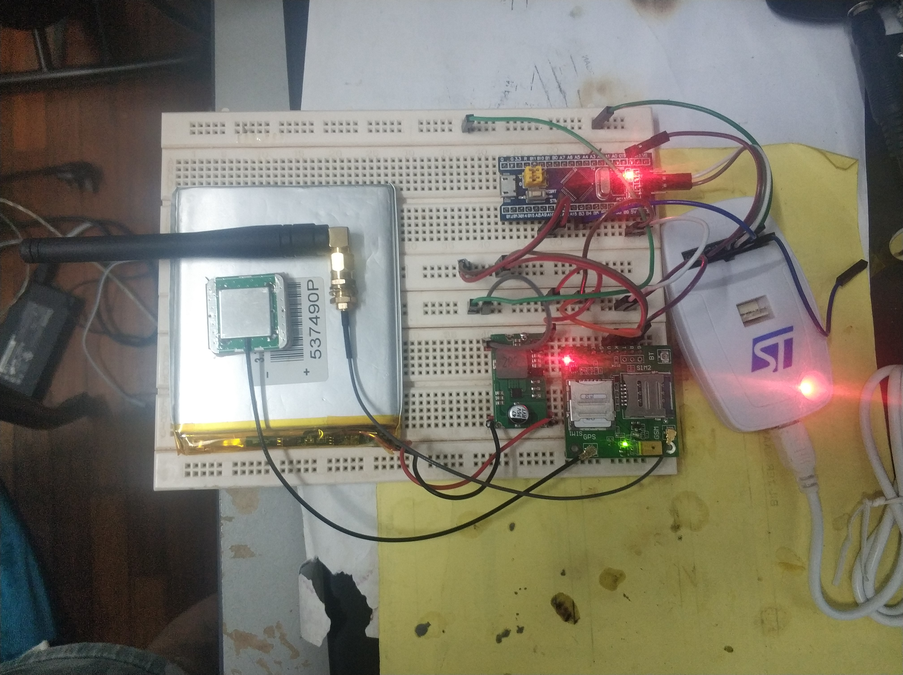

# STM32_SIM868

This project was developed with :-  
1. STM32CubeMX 6.0.1  
2. Keil uVision 5.32.0.0 

List of hardwares used :- 
1. STM32 blue pill 
2. DC-DC converter module
3. lithium polymer battery
4. ST-Link V2 programmer
5. CH340 USB to Serial

Reference:  
1. http://www.bepat.de/2020/12/02/stm32f103c8-uart-with-dma-buffer-and-idle-detection/  
2. https://blog.csdn.net/as480133937/article/details/104827639?utm_medium=distribute.pc_relevant.none-task-blog-2%7Edefault%7EBlogCommendFromBaidu%7Edefault-9.control&depth_1-utm_source=distribute.pc_relevant.none-task-blog-2%7Edefault%7EBlogCommendFromBaidu%7Edefault-9.control  
3. https://controllerstech.blogspot.com/2017/07/using-serial-communication-in-stm32.html  

